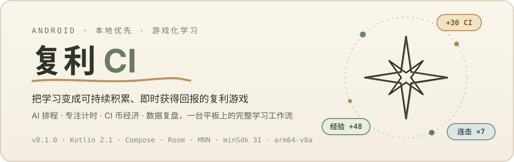
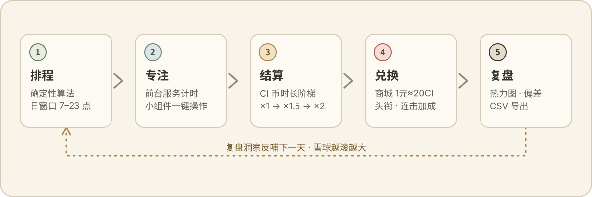
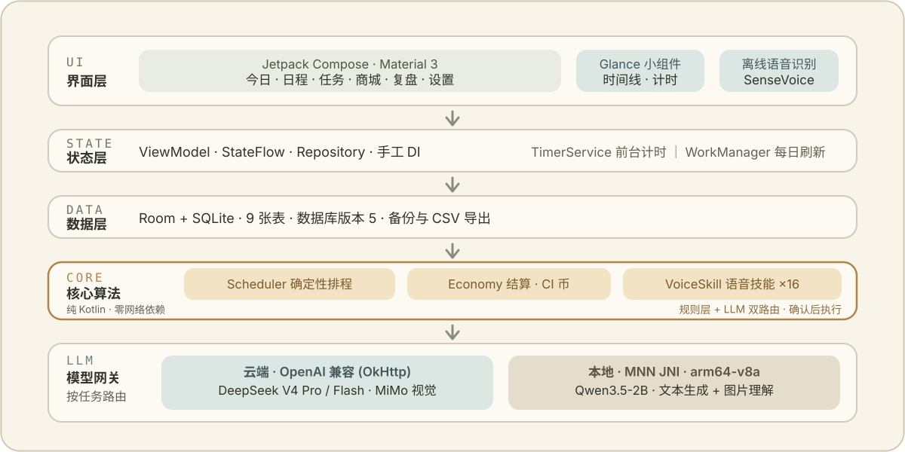

<p align="center">
  
</p>

**复利（Compound Interest，CIM）** 是一款个人使用的游戏化 AI 学习日程 Android 应用，为横屏平板设计。它把学习任务、确定性排程、专注计时、CI 币经济和数据复盘放进同一个**本地优先**的工作流：今天投入的每一分钟专注，都会立刻变成看得见的币、经验和头衔，再反哺明天的计划。

> 当前版本 `0.1.0` · 个人持续开发中，尚未上架应用商店。

<p align="center">
  
</p>

## 功能亮点

左侧导航栏提供六个页面：**今日**（时间线与专注操作）、**日程**（周视图与时间块编辑）、**任务**（领域 / 主线 / 支线管理与学习路线生成）、**商城**（奖励商品与每日精选）、**复盘**（统计图表与 CSV 导出）、**设置**（主题、模型路由与数据备份）。

### 确定性排程，不依赖大模型

排程核心是纯 Kotlin 的确定性算法，离线可用、结果可复现：

- 锁定的时间块和非 `PLANNED` 状态的任务固定不动；
- 临时占位事件、日窗口（默认 7:00–23:00）之外和已过去的时间不可用；
- 可移动任务按主线截止日期、原起始时间和任务 id 排序；
- 优先保留原位置，仅在冲突时移动，把日程扰动降到最低；
- 放不下的任务进入 `unplaced` 结果交给界面提示，绝不静默丢失。

### 游戏化经济：让每分钟专注都有即时回报

- CI 币按时长阶梯结算：前 30 分钟 ×1，30–60 分钟 ×1.5，超过 60 分钟的部分 ×2，再乘以难度（0.8–1.6）与专注结果系数；
- 经验 = 实际分钟 × 难度，不设阶梯，积累更诚实；
- 支线连击 7 / 30 / 100 天分别加成 10% / 25% / 50%，每日打卡另有定额奖励；
- 六级头衔体系（600 → 24000 经验），升级即奖 CI 币，专属头衔名可由 LLM 生成；
- 商城用 `1 元 ≈ 20 CI` 锚定现实奖励，每日精选 4 个折扣位，支持储蓄目标与手动兑现。

### 专注计时与桌面小组件

- 计时运行在 Android 前台服务中，状态以数据库中的 open session 为准，不怕后台回收；
- 两个 Glance 小组件：「今日时间线」和「当前任务计时」，桌面一键开始 / 结束。

### 离线语音建任务

- 内置 sherpa-onnx + SenseVoice-Small（int8）离线语音识别，说完即识、闲置自动释放；
- 语音指令解析链支持中文时间与拼音匹配，直接语音创建当天任务。

### 云端与本地双模 AI

LLM 只做辅助（路线生成、复盘分析、自然语言解析、商品估价、头衔生成、图片理解），核心功能离开它照常运转：

- **云端**：预置 DeepSeek V4 Pro / Flash 与 MiMo 的 OpenAI 兼容端点，按任务路由；
- **本地**：可下载 `Qwen3.5-2B · MNN`（约 1.39 GB，固定 revision + SHA-256 校验），完全离线推理，含图片理解；
- API Key 经 Android Keystore + `EncryptedSharedPreferences` 加密存储；
- 本地路由推理失败**不会**静默回退云端；未配置模型时调用方走离线兜底，不阻塞核心功能。

## 技术架构

<p align="center">
  
</p>

- Kotlin 2.1 · Jetpack Compose（Material 3）· Glance 1.1，单模块 `:app`；
- Room + SQLite（数据库版本 5，9 张表，含迁移），`StateFlow` 驱动 UI；
- WorkManager 每日刷新；OkHttp + `kotlinx.serialization` 处理云端 API；
- sherpa-onnx 1.13.5（本地 AAR）提供离线语音识别；
- MNN JNI（`native/mnn` 自编译）支持 `arm64-v8a` 本地模型推理；
- 29 个 JUnit4 JVM 测试类覆盖排程、经济、打卡、商城、导入导出、复盘聚合、语音解析、LLM 路由与本地模型下载，测试方法按约定使用中文反引号命名。

核心数据关系：

```text
domains → quests → tasks → sessions → ledger
                         ├→ shop_items / daily_picks / purchases
                         └→ blockers
```

时间约定：`epochDay: Long` 表示日期，`startMinute/endMinute: Int` 表示当天分钟区间，真实发生时间用毫秒时间戳。

## 快速开始

### 环境要求

- JDK 17，Android SDK（`compileSdk = 35`），`minSdk = 31`，目标设备 `arm64-v8a`；
- Android NDK 和 CMake 仅在重新构建 MNN JNI 时需要；
- 构建前创建 `local.properties` 写入 `sdk.dir=<你的SDK路径>`（或设置 `ANDROID_HOME`）。

本仓库约定的本机工具路径（如不同请自行替换）：JDK `/opt/homebrew/opt/openjdk@17`，adb `/opt/homebrew/share/android-commandlinetools/platform-tools/adb`。

### 构建与测试

首次 clone 后先拉取 sherpa-onnx AAR（走 GitHub Release，curl 失败自动回退 `gh release download`）：

```bash
voice/fetch_sherpa.sh
```

```bash
# 构建 Debug APK
JAVA_HOME=/opt/homebrew/opt/openjdk@17 ./gradlew assembleDebug

# 运行全部 JVM 单元测试
JAVA_HOME=/opt/homebrew/opt/openjdk@17 ./gradlew testDebugUnitTest

# 运行单个测试类
JAVA_HOME=/opt/homebrew/opt/openjdk@17 ./gradlew testDebugUnitTest \
  --tests "com.wsy.ci.core.scheduler.SchedulerTest"
```

APK 输出在 `app/build/outputs/apk/debug/app-debug.apk`。当前只有 JVM 单元测试，没有 instrumented 测试。

### 安装到平板

```bash
/opt/homebrew/share/android-commandlinetools/platform-tools/adb install -r \
  app/build/outputs/apk/debug/app-debug.apk
```

### 首次使用

1. 在「任务」创建领域、主线或支线，再创建当天任务（或直接用语音）；
2. 在「今日」开始专注，结束后选择结果并结算 CI 币与经验；
3. 在「商城」维护想兑换的现实奖励，给自己定一个储蓄目标；
4. 在「复盘」查看时间分配、计划偏差与 CI 流水，导出 CSV；
5. 需要 AI 时，在「设置」配置 API Key 或下载本地模型，并按任务选择路由。

## 数据与隐私

- 任务、专注记录、经济流水和设置默认全部保存在本机；
- API Key 使用 `EncryptedSharedPreferences` 与 Android Keystore 加密；
- 支持数据库级备份与恢复、JSON 导入（带预览）、复盘明细 CSV 导出；
- 云端 LLM 仅在显式配置并启用路由后调用；本地路由失败不会把请求发往云端。

## 项目结构

```text
.
├── app/src/main/java/com/wsy/ci/
│   ├── core/          # 数据库、Repository、排程、经济、备份、导入导出、语音解析、设计系统
│   ├── feature/       # 今日、日程、任务、商城、复盘、设置、语音等 Compose 页面
│   ├── llm/           # LLM 抽象、按任务路由、云端 OpenAI 兼容客户端
│   ├── localmodel/    # 本地模型下载、校验与运行时控制（MNN）
│   ├── voice/         # sherpa-onnx 离线语音识别
│   ├── widget/        # Glance 小组件与前台计时服务
│   └── work/          # WorkManager 后台任务
├── app/src/test/      # JVM 单元测试
├── native/mnn/        # MNN JNI 构建脚本与 C++ 桥接
└── THIRD_PARTY_NOTICES.md
```

## 当前限制

- 复盘页部分图表仍为自绘或占位，规划中的 Vico 图表库尚未接入；
- 本地模型已通过下载、校验、运行与路由，长时间运行与连续推理的耐久验收仍在进行；
- 仅提供 `arm64-v8a` 原生库；没有 instrumented 测试，真机行为需手动验收；
- 尚未发布到 Google Play 或其他应用商店。

## 许可与第三方声明

本项目自身以 [Apache License 2.0](LICENSE) 开源，Copyright © 2026 吴思毅。MNN、Qwen3.5-2B、sherpa-onnx 及模型转换相关组件的归属与许可不受本许可影响，完整条款见 [THIRD_PARTY_NOTICES.md](THIRD_PARTY_NOTICES.md)。分发 APK 前请确认所有第三方组件与模型的使用条件。
